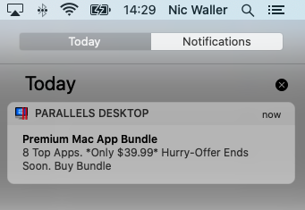
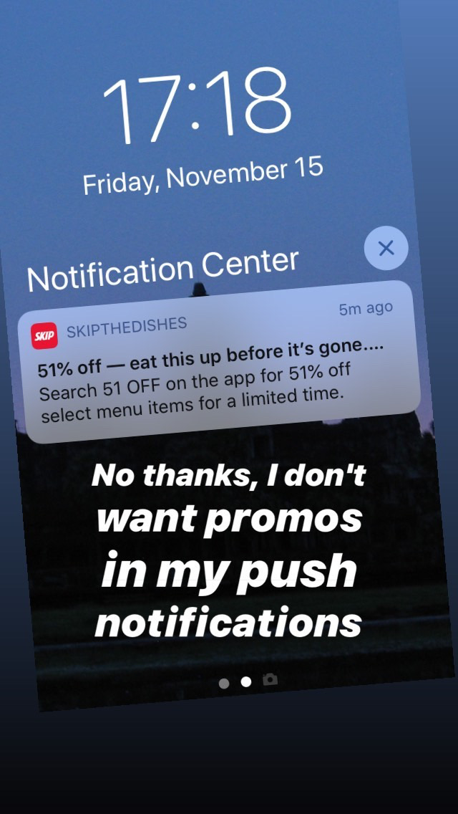
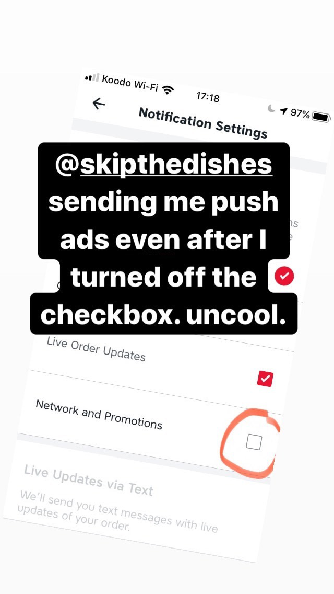

# adbuse
Shaming orgs that abuse notifications to send advertisements

## Productive (iOS App Store)

An in-app modal pop-up in an app that was already paid for.

## Parallels (macOS)

This an ad inside expensive, professional (?) software that I've already paid for. It's not just a regular ad, it's a push notification ad.

## Skip The Dishes

## Ritual

